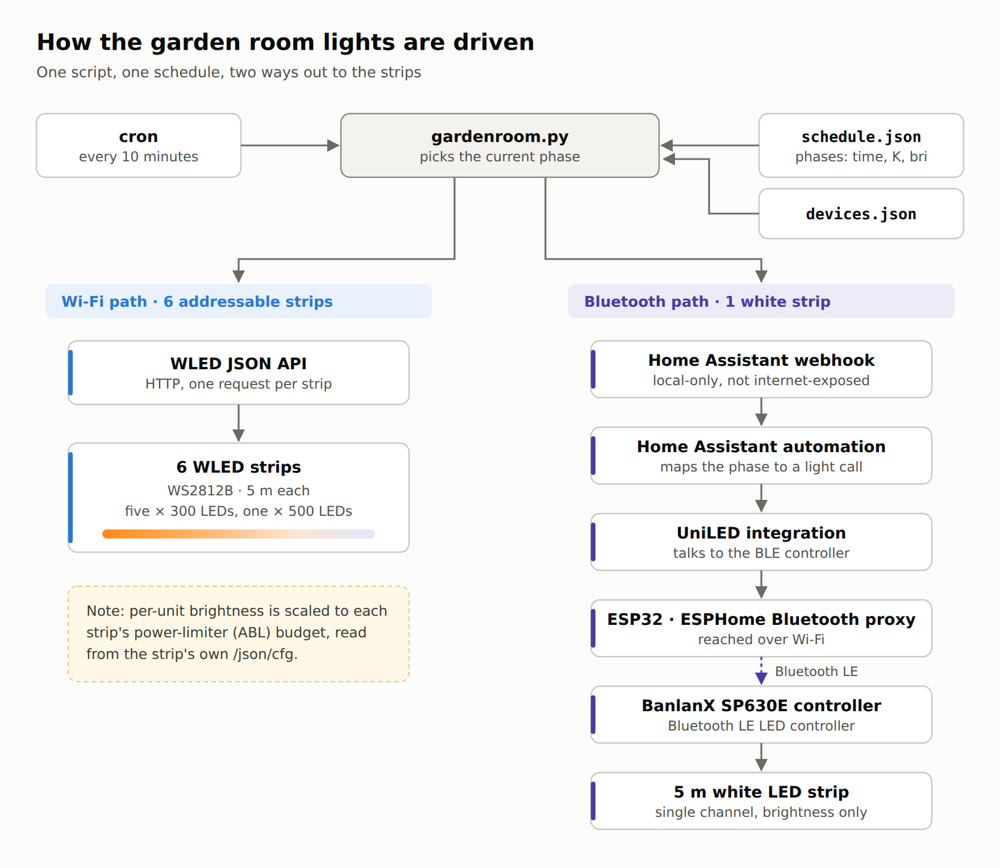
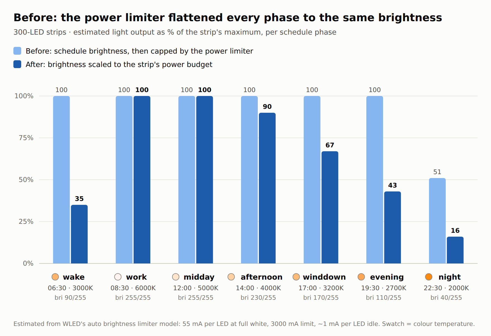
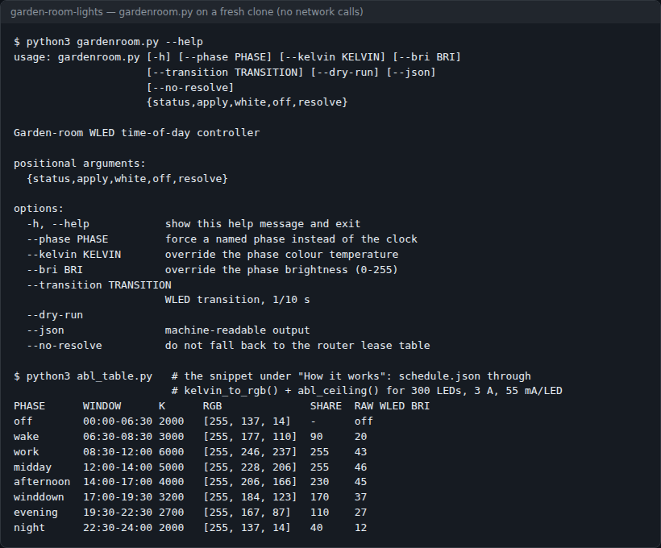
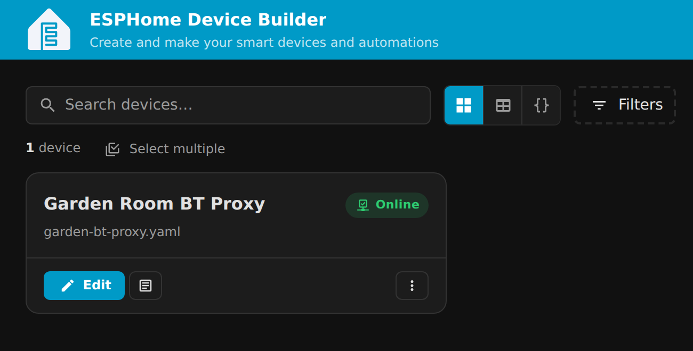
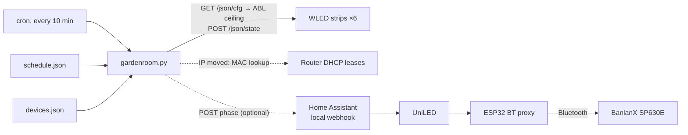

# garden-room-lights

Time-of-day lighting for one room of cheap WLED strips, with brightness that respects each strip's power limiter, plus a Bluetooth-only BanlanX SP630E white strip brought into Home Assistant through an ESP32.



[](LICENSE)
-blue.svg)

It comes from my own garden room (about 15 m², six WLED strips, one white strip), so it isn't a polished product. It works, and most of the value is in the things that took a while to find, written up below.

## Contents

- [What it does](#what-it-does)
- [Screenshots](#screenshots)
- [Quick start](#quick-start)
- [Usage](#usage)
- [Configuration](#configuration)
- [How it works](#how-it-works)
- [Status, limits and real results](#status-limits-and-real-results)
- [Licence and credits](#licence-and-credits)

## What it does

- Splits the day into phases in `schedule.json` (kelvin, brightness, on/off) and applies the one that matches the wall clock. A dumb 10-minute cron tick is enough, and nothing changes when the clocks go forward or back.
- Drives every WLED unit directly over its JSON API, so it works whether or not Home Assistant can see them. Python 3 standard library only.
- Treats `bri` as a share of what each unit can really deliver at that colour. It reads each unit's `/json/cfg` and works out the raw WLED brightness under its automatic brightness limiter (ABL), so the phases differ in brightness and not just colour.
- `status` reports what every unit is doing and flags known faults: units sitting on their power cap, a sync group broadcasting to the rest of the house, and the `lc: 0` "colour silently ignored" bug. For the last two it prints the curl that fixes it.
- Finds a strip again by MAC in an OpenWrt-style router's DHCP leases when its IP moves (optional), and `resolve` writes the new IPs back.
- Optionally posts each phase to a local-only Home Assistant webhook, which drives the Bluetooth-only SP630E through an ESPHome Bluetooth proxy and UniLED.
- Ships an HA-only alternative (`home-assistant/script.apply_room_lighting.yaml`) that applies the phase to every light in an area, whatever the brand.

## Screenshots



*Estimated light output per phase for a 300-LED strip, before and after brightness was scaled to the ABL budget. Estimated from WLED's ABL model, not measured with a meter.*



*`gardenroom.py --help`, and the shipped `schedule.json` run through the script's own `kelvin_to_rgb()` and `abl_ceiling()` for a 300-LED strip on a 3 A limit. No network calls: the unit config is passed in (snippet under [How it works](#how-it-works)).*



*The ESP32 Bluetooth proxy online in the ESPHome dashboard.*

## Quick start

You need Python 3 and at least one WLED unit on your network.

```bash
git clone https://github.com/casareanderson/garden-room-lights
cd garden-room-lights
cp devices.example.json devices.json      # add your WLED units: MAC + last known IP
python3 gardenroom.py status              # what each unit is doing, and any faults
python3 gardenroom.py apply --dry-run     # what the current phase would set
python3 gardenroom.py apply               # do it
```

Success looks like a line per unit with `ok` and the raw brightness it set:

```
phase 'work' -> ON bri=255 6000K rgb=[255, 246, 237]
  gr1    192.0.2.50      ok         bri=43
```

Then run it every 10 minutes from cron. `cron.example` is a ready `/etc/cron.d` file that expects the repo at `/opt/garden-room-lights`.

## Usage

| Command | What it does |
|---|---|
| `gardenroom.py status [--json]` | Reachability, on/off, brightness, colour, effect and power draw per unit, plus fault warnings |
| `gardenroom.py apply` | Apply the phase for the current time |
| `gardenroom.py apply --phase evening` | Force a named phase instead of the clock |
| `gardenroom.py apply --kelvin 4000 --bri 120` | Override colour temperature and/or brightness (0–255) |
| `gardenroom.py white` | Task light: stays on the current tier if it is a daytime `working` phase, otherwise jumps to `work` |
| `gardenroom.py off` | Apply the `off` phase |
| `gardenroom.py resolve` | Look every unit's MAC up in the router's DHCP leases and rewrite `devices.json` |

Every action takes `--dry-run`, `--json`, `--transition` (WLED tenths of a second, default 14) and `--no-resolve`. `apply` exits 1 and lists the units it couldn't reach.

### Bring in the Bluetooth-only SP630E

The SP630E has no WiFi (that's the SP530E). To get it into Home Assistant:

1. Flash any plain ESP32 with `esphome/bt-proxy.yaml` (web.esphome.io over USB first, then over the air). Copy `esphome/secrets.example.yaml` to `secrets.yaml` first.
2. Install [UniLED](https://github.com/monty68/uniled) from HACS and apply `patches/uniled-attr-color-temp.md`. The latest release crashes on current HA, and it looks like a Bluetooth fault when it isn't.
3. **Close the BanlanX phone app.** The controller allows one Bluetooth connection at a time, and the app takes it.
4. Give the ESP32 **good WiFi**. Mine joined a distant mesh node at -83 dBm and every Bluetooth connect timed out. Putting the nearby access point first in the config fixed it.
5. Copy `ha_webhook.example.json` to `ha_webhook.json` with a long random id, put the same id in `home-assistant/automation.banlanx_webhook.yaml`, and add that automation to HA.

Each run then posts `{phase, power, bri, kelvin}` to the webhook. It is `local_only`, so it needs no HA token. The strip follows its own `bri_white` column: full in working hours, off in the evening, because a plain white strip can't go warm.

## Configuration

| Name | Default | What it does |
|---|---|---|
| `devices.json` | none (copy `devices.example.json`) | WLED units: `key`, `name`, `mac` (the identity), `ip` (last known), `entity` |
| `schedule.json` | shipped, 8 phases | `timezone` and `phases`. Each phase has `name`, `from`, `to`, `power`, `kelvin`, `bri` (share of the ABL ceiling, 0–255), `bri_white` (SP630E) and optional `working`. Windows are checked in order and must tile the whole day |
| `ha_webhook.json` | absent = off | `key`, `entity`, `url` of the local-only HA webhook |
| `GARDENROOM_ROUTER` | unset = off | SSH target of an OpenWrt-style router whose `/tmp/dhcp.leases` maps MAC to IP, e.g. `root@192.0.2.1` |
| `GARDENROOM_ROUTER_KEY` | unset | SSH key for that router |
| `esphome/secrets.yaml` | none (copy the example) | WiFi, API encryption key and OTA password for the Bluetooth proxy |

`devices.json`, `ha_webhook.json` and `esphome/secrets.yaml` are git-ignored.

The shipped schedule:

| Phase | Window | Kelvin | `bri` | `bri_white` |
|---|---|---|---|---|
| off | 00:00–06:30 | 2000 | 0 (off) | 0 |
| wake | 06:30–08:30 | 3000 | 90 | 90 |
| work | 08:30–12:00 | 6000 | 255 | 255 |
| midday | 12:00–14:00 | 5000 | 255 | 255 |
| afternoon | 14:00–17:00 | 4000 | 230 | 230 |
| winddown | 17:00–19:30 | 3200 | 170 | 90 |
| evening | 19:30–22:30 | 2700 | 110 | 0 |
| night | 22:30–24:00 | 2000 | 40 | 0 |

The numbers come from `docs/research.md` (EN 12464-1 and Brown et al. 2020, with sources). Edit freely: the script has no times baked in.

## How it works



Each run picks the phase for the local time, converts its kelvin to RGB (the strips have no white channel, so "5000 K" means the RGB triple that reads as 5000 K, using Tanner Helland's approximation), then writes each unit individually with a brightness scaled to that unit's limiter.

**The power limiter was flattening the whole schedule.** WLED's ABL estimates current as `ledma × (r+g+b)/765` per LED plus about 1 mA idle, and scales the strip down once that passes `maxpwr`. With the default 55 mA/LED and a 3 A limit on 300 LEDs, it cuts in at a raw brightness of about 43 (cool white) to 79 (very warm). The schedule asked for 90 to 255, so wake, work, afternoon, wind-down and evening all came out at the same brightness. Only the colour changed. `abl_ceiling()` now works out that ceiling per unit, and `bri` is a share of it. If you raise `maxpwr` later, it scales up on its own. Don't raise `maxpwr` past what your power supply is rated for: ABL is a sum, not a measurement, and it can't protect a PSU it has been told is bigger than it is.

The table in the second screenshot comes from this snippet, run from the repo root:

```python
import json, gardenroom as g
# a 300-LED strip on a 3 A limit at WLED's default 55 mA/LED (no network: cfg is given)
g.wled = lambda ip, path="/json", payload=None: {"hw": {"led": {"total": 300, "maxpwr": 3000, "ledma": 55, "ins": [{}]}}}
for p in json.load(open("schedule.json"))["phases"]:
    rgb = g.kelvin_to_rgb(p["kelvin"])
    raw = "off" if not p["power"] else max(1, round(int(p["bri"]) * g.abl_ceiling("x", rgb) / 255.0))
    print(p["name"], p["kelvin"], list(rgb), raw)
```

**WLED sync groups span the whole house.** One strip had "send notifications" on, group 1, and every other WLED unit in the house receives group 1. So every schedule change here quietly changed the kitchen and the 3D printer lights too. The script writes each unit directly and doesn't need sync. `status` warns if any unit is broadcasting and prints the curl to turn it off.

**`lc: 0` means colour silently does nothing.** Two strips ignored every colour and showed plain white, with no error anywhere. The tell is `info.leds.lc == 0` (no light capability registered on the bus), seen on WLED 0.15.x after upgrading from 0.14. Re-posting the unchanged LED bus config to `/json/cfg` fixes it. `status` detects it and prints the exact command.

**RGB strips don't do white.** No white channel means "4000 K" is an RGB mix with a green cast and poor colour rendering. That's why the SP630E white strip matters.

```
garden-room-lights/
├── gardenroom.py                 the controller: status, apply, white, off, resolve
├── schedule.json                 the day's phases (the only schedule)
├── devices.example.json          WLED units by MAC
├── ha_webhook.example.json       optional HA webhook for the SP630E
├── cron.example                  /etc/cron.d file, 10-minute tick
├── esphome/bt-proxy.yaml         ESP32 Bluetooth proxy for the SP630E
├── home-assistant/
│   ├── automation.banlanx_webhook.yaml        webhook → SP630E
│   ├── script.apply_room_lighting.yaml        HA-only: light a whole area
│   └── automation.room_lighting_schedule.yaml HA-only schedule
├── patches/uniled-attr-color-temp.md          one-line UniLED fix for current HA
└── docs/research.md              where the schedule's numbers come from
```

## Status, limits and real results

- **Measured on 2026-09-25 (recorded in `abl_ceiling()`'s docstring):** wake through evening all sat at the power cap before the fix. The ABL ceiling was about 43–63 on the 300-LED units and about 4 on one 500-LED unit with an 850 mA limit, so the schedule's ramp only ever changed colour.
- **The before/after chart is an estimate** from WLED's ABL model, not a light-meter reading.
- **How much light a room needs.** EN 12464-1 asks for about 300 lux for general use and 500 lux at a desk. In 15 m², with strips bouncing light off walls and ceiling, that is somewhere around 10,000 to 20,000 lumens installed. Six 300-LED WS2812B strips on 3 A supplies give roughly 1,200 to 1,800 lumens, about 25 to 40 lux. That is my estimate from WLED's own current figures, not a measurement. In other words the strips are mood lighting, and the working light has to come from real white LEDs. Measure yours with a phone lux app before trusting any of these numbers, mine included.
- The router fallback assumes an OpenWrt-style `/tmp/dhcp.leases` reachable over SSH. Other routers need their own lookup.
- The schedule follows the local wall clock in `schedule.json`'s `timezone` (`Europe/London` shipped). Motion, presence and daylight sensing are not part of this repo.
- There are no automated tests.

## Licence and credits

MIT, see [LICENSE](LICENSE).

- [WLED](https://github.com/Aircoookie/WLED) and its JSON API, [ESPHome](https://esphome.io) and [Home Assistant](https://www.home-assistant.io) do the heavy lifting. This repo only talks to them.
- [UniLED](https://github.com/monty68/uniled) by monty68 drives the BanlanX controller in HA. The patch in `patches/` is a note on how to fix it locally, not a fork.
- Kelvin-to-RGB uses Tanner Helland's planckian approximation.
- Schedule research sources (EN 12464-1, Brown et al. 2020 and others) are cited in [docs/research.md](docs/research.md).

If this is useful to you, [buy me a coffee](https://buymeacoffee.com/iamc_tech) ☕
